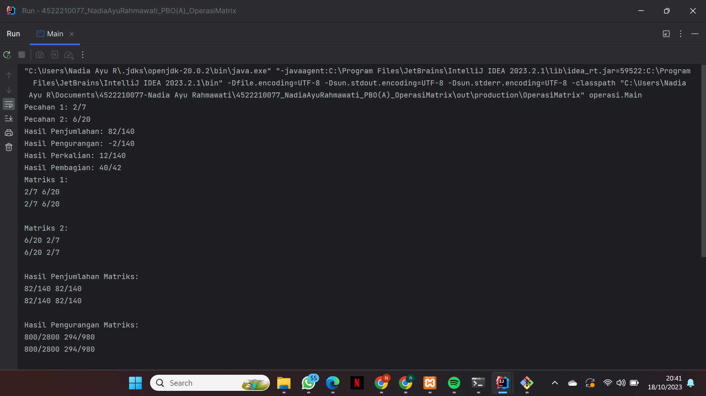
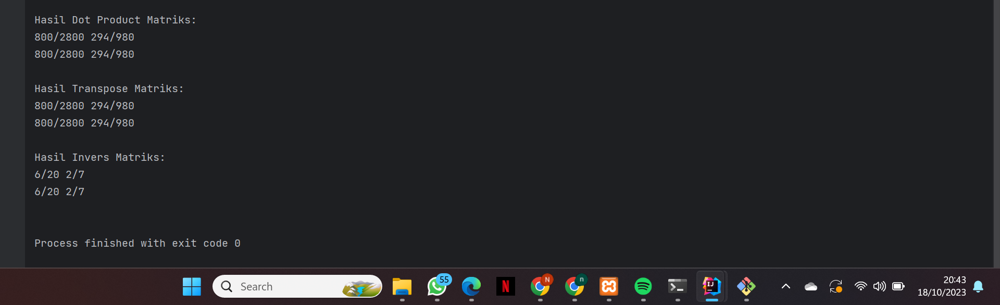

# Tugas_PBO
## NAMA : NADIA AYU RAHMAWATI
## NPM  : 4522210077
# soal
Membuat class Pecahan yang terdapat operasi penjumlahan, pengurangan, perkalian, pembagian
Kemudian class Matrik yang elemennya Pecahan dengan operasi:
penjumlahan matrik, pengurangan matriks, dot matrik, transpose matrik, inverse matrik
# Hasil Run

